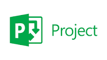

# Gerenciamento de Projeto

Nós escolhemos como metodologia o Scrum, pois vimos que é uma metodologia eficaz e atende perfeitamente os nossos objetivos.

## Relação de Ambientes de Trabalho

Os artefatos escolhidos são divididos de acordo com suas funções e objetivos que segue:

| Ambiente       | Plataforma    | Link de Acesso| 
|----------------|---------------|---------------|
| Repositório de Código Fonte | GitHub | inserir link | 
| Documentos do Projeto   | GitHub  |  inserir link | 
| Projeto de Interface e  Wireframes   | acolocar  | inserir link | 
| Gerenciamento do Projeto   | Trello  | inserir link | 

## Divisão de Papéis

* Phillipe Raul Batista Cobra
* Matheus Kayky Ferreira Santos
* 

## Processo

> Coloque  informações sobre detalhes da implementação do Scrum seguido
> pelo grupo. O grupo poderá fazer uso de ferramentas on-line para acompanhar
> o andamento do projeto, a execução das tarefas e o status de desenvolvimento
> da solução.

## Ferramentas

As ferramentas empregadas no projeto são:

- Editor de código.
- Ferramentas de comunicação
- Ferramentas de diagramação

O editor de código foi escolhido porque ele possui uma integração com o
sistema de versão. As ferramentas de comunicação utilizadas possuem
integração semelhante e por isso foram selecionadas. Por fim, para criar
diagramas utilizamos essa ferramenta por melhor captar as
necessidades da nossa solução.

> Liste quais ferramentas foram empregadas no desenvolvimento do
> projeto, justificando a escolha delas, sempre que possível.
> 
> **Possíveis Ferramentas que auxiliarão no gerenciamento**: 
> - 
> - 
> 
> - 
> - 
